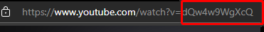
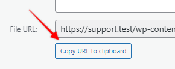
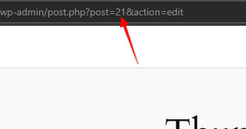

=== Video Facade for YouTube ===
Contributors: lloydrick
Donate link: https://ricklabs.net/buy-me-a-coffee
Tags: facade, optimization
Requires at least: 4.7
Tested up to: 6.8
Stable tag: 4.3
License: GPLv2 or later
License URI: https://www.gnu.org/licenses/gpl-2.0.html
Here is a short description of the plugin.  This should be no more than 150 characters.  No markup here.

Show a facade/thumbnail for a YouTube Video and load YouTube video only on click.

== Description ==

This plugin adds a shortcode to display a YouTube thumbnail, and loads the video only on click:

`[yvf id="" thumbnail="" alt=""]`

It aims to solve the [Lazy load third-party resources with facades](https://developer.chrome.com/docs/lighthouse/performance/third-party-facades) flag on Lighthouse by preventing YouTube assets from being loaded until the user clicks the play button.

The shortcode accepts three parameters:
1. `id` - YouTube Video ID
2. `thumbnail` - URL of the image used for the thumbnail
3. `alt` - Alt text for the thumbnail

### To use the plugin
1. Download and install the latest version from the Releases - https://github.com/Rick-Labs/youtube-video-facade-shortcode/releases
2. Activate the plugin
3. Add the shortcode using the Shortcode Block and supply the `id`, `thumbnail`, and `alt` values.

### To get the YouTube Video ID
The video id comes after the `watch?v=` URL query string:

### To get the image URL
1. Upload the thumbnail to your WordPress media library
2. Open the image, and click `Copy URL to Clipboard` to get the image URL:

### IMPORTANT!
You need to enqueue the CSS and JS on the page where you added the shortcode. This is done manually for now for performance reasons, but a more efficient method is in the works.

1. Get the post ID. You can get this when editing:

2. Add the post ID to the array of pages where the CSS and JS will be loaded, by editing the plugin under `Tools -> Plugin File Editor`.
3. Look for YouTube Video Facade from the dropdown list, then hit `Select`.
4. Look for the `$target_page_ids` variable, which is an array.
5. Insert the post ID in the array, e.g. `$target_page_ids = array(21,23);`
6. Add the post IDs of pages/posts containing the shortcode as necessary.

That's it! You won't get the `Lazy load third-party resources with facades` warning anymore!